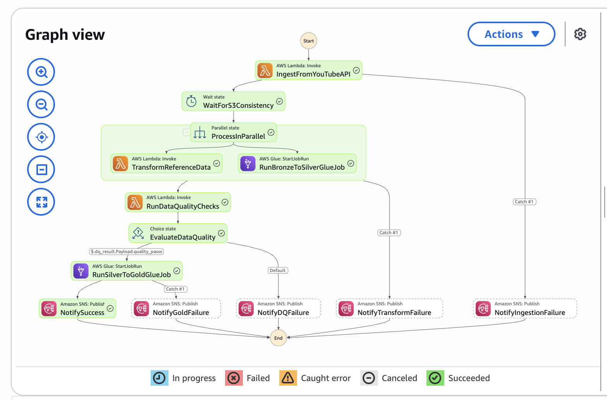
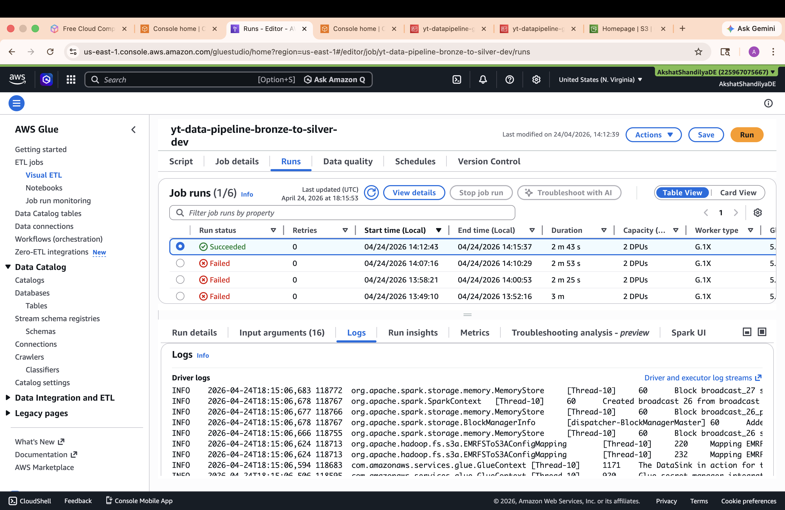
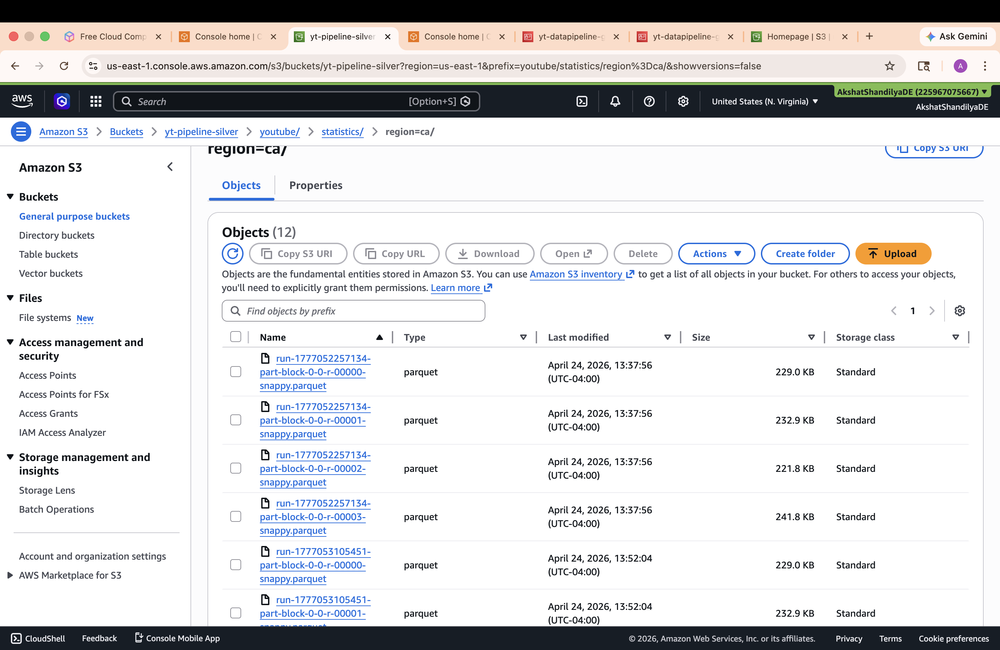
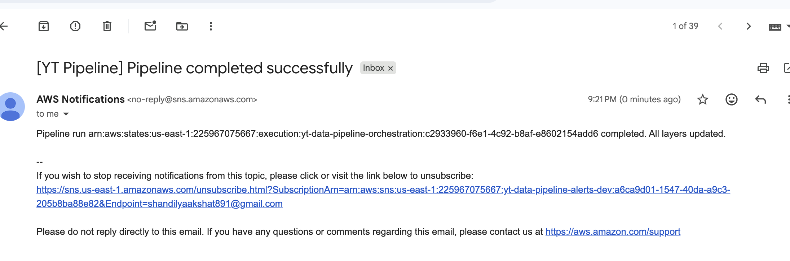

# YouTube Trending Intelligence — Data Pipeline & Campaign Dashboard

> A cloud-native ETL pipeline that ingests YouTube trending video data across 10 regions,
> transforms it through a medallion architecture (Bronze → Silver → Gold), enforces data
> quality gates, and surfaces campaign intelligence via Amazon QuickSight.


---

## What's New (Evolved from Original)

| Addition | Description |
|---|---|
| `ingestion/download_kaggle.py` | Automates Kaggle dataset download + Python-driven S3 partitioning by `region` |
| `ingestion/aws_boto.py` | AWS resource provisioning via Boto3 — replaces manual console setup |
| `infrastructure/lambda/lambda_data_validation.py` | Pre-ingestion validation before data hits Bronze layer |
| `sql/athena/` | 4 Athena queries powering QuickSight SPICE datasets |
| `dashboard/` | Amazon QuickSight campaign dashboard with 4 targeted visuals |

Historical data upload is now handled via Python with `region=` Hive partitioning —
replacing the original `aws_copy.sh` shell script approach.

---

## Problem Statement

Marketing team is launching a data-driven YouTube campaign. This project analyzes
trending video data across regions to answer 4 key campaign questions:

| # | Question | Visual |
|---|---|---|
| Q1 | Where should we target? | Scatter plot — engagement vs views by region |
| Q2 | What content should we align with? | Line chart — category view share over time |
| Q3 | Who should we partner with? | Horizontal bar — top 15 channels by consistency |
| Q4 | When should we publish? | Combo chart — daily views vs engagement pulse |

---

## Architecture

```
Data Sources       Bronze            Silver          Quality Gate        Gold             Analytics
┌──────────┐   ┌──────────────┐  ┌──────────────┐  ┌────────────┐  ┌──────────────┐  ┌──────────────┐
│ YouTube  │   │              │  │              │  │            │  │  trending_   │  │    Athena    │
│ API v3   │──>│  Raw JSON    │─>│  Cleansed    │─>│ DQ Lambda  │─>│  analytics   │─>│    Queries   │
│          │   │  (S3)        │  │  Parquet     │  │            │  │              │  │              │
├──────────┤   │              │  │  (S3)        │  │  Validates │  │  channel_    │  ├──────────────┤
│  Kaggle  │   │  Raw CSV     │  │              │  │  row count │  │  analytics   │  │  QuickSight  │
│ Dataset  │──>│  (S3)        │  │  Reference   │  │  nulls     │  │              │  │  Dashboard   │
│(auto dl) │   │              │  │  Parquet     │  │  schema    │  │  category_   │  │              │
└──────────┘   └──────────────┘  └──────────────┘  │  freshness │  │  analytics   │  └──────────────┘
                                                    └────────────┘  └──────────────┘
                                                         │
                                                    fail │
                                                         ▼
                                                   ┌────────────┐
                                                   │ SNS Alert  │
                                                   └────────────┘
```

Orchestration handled by AWS Step Functions with retry logic, parallel execution,
and SNS failure notifications at every stage.

---

## Infrastructure Screenshots

### Step Functions — Pipeline State Machine


### Glue Jobs — Bronze to Silver


### Lambda — JSON to Parquet


### SNS — Pipeline Alerts


---

## Tech Stack

| Component | Technology |
|---|---|
| Compute | AWS Lambda, AWS Glue (PySpark) |
| Storage | Amazon S3 (Parquet, Snappy) |
| Orchestration | AWS Step Functions |
| Scheduling | Amazon EventBridge |
| Metadata | AWS Glue Data Catalog |
| Query Engine | Amazon Athena |
| Visualization | Amazon QuickSight (SPICE) |
| Alerting | Amazon SNS |
| Monitoring | Amazon CloudWatch |
| Languages | Python 3, PySpark, SQL (Athena/Presto) |
| Libraries | Pandas, AWS Wrangler, Boto3, kaggle |
| Data Format | Parquet (Snappy compression) |

---

## Project Structure

```
youtube-trending-campaign-analytics/
│
├── data/                                    # Reference & historical data
│   ├── {region}videos.csv                   # Kaggle trending datasets (10 regions)
│   └── {region}_category_id.json            # YouTube category ID mappings (10 regions)
│
├── ingestion/
│   ├── aws_boto.py                          # AWS resource provisioning via Boto3
│   └── download_kaggle.py                   # Auto-downloads Kaggle dataset + partitions to S3
│
├── etl/
│   ├── AWS_glue_bronze_silver.py            # PySpark: raw data → cleansed statistics
│   ├── AWS_glue_silver_gold.py              # PySpark: cleansed data → business aggregations
│   └── lambda_json_parquet.py               # Converts JSON category mappings to Parquet
│
├── infrastructure/
│   ├── glue/                                # Glue crawler config documentation
│   ├── lambda/
│   │   ├── lambda_data_validation.py        # Pre-ingestion data validation Lambda
│   │   ├── lambda_json_parquet.py           # Reference data transformation Lambda
│   │   └── lambda_youtube_API_Ingestion.py  # Fetches live trending data from YouTube API v3
│   └── step-function/
│       └── pipeline-state-machine.json      # Step Functions state machine (ARNs parameterized)
│
├── sql/
│   └── athena/
│       ├── ds_region_targeting.sql          # Q1 — region engagement comparison
│       ├── ds_category_momentum.sql         # Q2 — category view share over time
│       ├── ds_channel_partners.sql          # Q3 — channel consistency ranking
│       └── ds_publish_timing.sql            # Q4 — daily views vs engagement pulse
│
├── dashboard/
│   ├── screenshots/
│   │   └── Campagin_dashboard.pdf           # Full QuickSight campaign dashboard export
│   └── infra-screenshots/
│       ├── yt-pipeline-step-function.png    # Step Functions state machine visual
│       ├── yt-data-bronze-silver-glue.png   # Glue bronze→silver job
│       ├── yt-json-parquet.png              # JSON→Parquet Lambda
│       └── yt-sns-confirmation.png          # SNS alert confirmation
│
├── notebooks/
│   └── testing.ipynb                        # Local exploration and testing
│
├── .env.example                             # Environment variable template
├── .gitignore
├── information.md                           # AWS resource names & config reference
├── requirements.txt
└── README.md
```

---

## Data Flow

### Bronze Layer
**YouTube API Lambda** (`lambda_youtube_API_Ingestion.py`) fetches top 50 trending
videos per region, stored as raw JSON:

```
s3://yt-data-pipeline-bronze-${AWS_REGION}-dev/
  youtube/raw_statistics/region=US/date=2026-04-01/hour=12/
  youtube/raw_statistics_reference_data/region=US/
```

**Kaggle historical data** is auto-downloaded via `download_kaggle.py` and uploaded
to Bronze with Python-driven `region=` Hive partitioning.

### Silver Layer
Two parallel transformations run on Bronze data:

**Glue Job: `AWS_glue_bronze_silver.py`**
- Schema enforcement across API JSON and Kaggle CSV formats
- Type casting, null handling, deduplication
- Derived metrics: `like_ratio`, `engagement_rate`
- Output: Parquet/Snappy, partitioned by `region`

**Lambda: `lambda_json_parquet.py`**
- Normalizes JSON category mappings to tabular Parquet
- Deduplicated, partitioned by `region`

### Data Quality Gate
Before Gold, the DQ Lambda validates Silver data:

| Check | Threshold |
|---|---|
| Row count | >= 10 rows |
| Null percentage | <= 5% on critical columns |
| Schema validation | Required columns present |
| Data freshness | < 48 hours since last write |

Pipeline halts and sends SNS alert on failure. Gold does not execute.

### Gold Layer
**Glue Job: `AWS_glue_silver_gold.py`** produces three analytics tables:

**`trending_analytics`** — Daily metrics per region
| Column | Description |
|---|---|
| `region` | Country code |
| `trending_date_parsed` | Date of snapshot |
| `total_views` | Sum of all views |
| `total_likes` | Sum of all likes |
| `avg_engagement_rate` | Average engagement rate |
| `unique_channels` | Distinct channel count |
| `unique_categories` | Distinct category count |

**`channel_analytics`** — Channel-level performance
| Column | Description |
|---|---|
| `channel_title` | YouTube channel name |
| `total_views` | Total views across trending videos |
| `avg_engagement_rate` | Average engagement rate |
| `times_trending` | Times appeared in trending |
| `rank_in_region` | Performance rank within region |
| `categories` | Categories the channel appears in |

**`category_analytics`** — Category breakdowns
| Column | Description |
|---|---|
| `category_name` | Video category |
| `video_count` | Videos in category |
| `total_views` | Total views for the category |
| `avg_engagement_rate` | Average engagement rate |
| `view_share_pct` | Percentage of total views |

All Gold tables: Parquet (Snappy), partitioned by `region`, registered in Glue Data Catalog
under `yt-pipeline-gold-dev`, queryable via Athena.

---

## Campaign Dashboard

Built on Amazon QuickSight connected to Athena → Glue Data Catalog → Gold S3 tables.
Full dashboard: [`dashboard/screenshots/Campagin_dashboard.pdf`](dashboard/screenshots/Campagin_dashboard.pdf)

### Q1 — Where should we target?
Scatter plot: `avg_engagement_rate` (Y) vs `total_views` (X), bubble size = `unique_channels`.
Top-right quadrant = priority markets — high reach AND high engagement.
> SQL: [`sql/athena/ds_region_targeting.sql`](sql/athena/ds_region_targeting.sql)

### Q2 — What content should we align with?
Line chart: `view_share_pct` over `trending_date_parsed` per `category_name`.
Rising lines = content with growing momentum. Filtered by `region`.
> SQL: [`sql/athena/ds_category_momentum.sql`](sql/athena/ds_category_momentum.sql)

### Q3 — Who should we partner with?
Horizontal bar: Top 15 channels ranked by `times_trending`.
Long bar = consistent trending presence — separates reliable partners from one-hit channels.
> SQL: [`sql/athena/ds_channel_partners.sql`](sql/athena/ds_channel_partners.sql)

### Q4 — When should we publish?
Combo chart: `total_views` (bars) + `avg_engagement_rate` (line) by date.
Days where both peak = optimal publish window for the campaign.
> SQL: [`sql/athena/ds_publish_timing.sql`](sql/athena/ds_publish_timing.sql)

### QuickSight Setup
1. Data source → Athena → workgroup `primary` → database `yt-pipeline-gold-dev`
2. Create 4 SPICE datasets using queries from `sql/athena/`
3. Add sheet-level `region` filter — linked across Q2, Q3, and Q4 simultaneously
4. Set SPICE refresh → daily at 6AM UTC

---

## Setup

### Prerequisites
- AWS account with Lambda, Glue, S3, Step Functions, SNS, Athena, QuickSight access
- YouTube Data API v3 key from [Google Cloud Console](https://console.cloud.google.com/)
- Kaggle API credentials at `~/.kaggle/kaggle.json`
- AWS CLI configured
- Python 3.9+

### Environment Variables

Create a `.env` file from `.env.example`:

```bash
# AWS
AWS_ACCOUNT_ID=your-account-id
AWS_REGION=ap-south-1

# S3 Buckets
S3_BUCKET_BRONZE=yt-data-pipeline-bronze-${AWS_REGION}-dev
S3_BUCKET_SILVER=yt-data-pipeline-silver-${AWS_REGION}-dev
S3_BUCKET_GOLD=yt-data-pipeline-gold-${AWS_REGION}-dev

# APIs
YOUTUBE_API_KEY=your-youtube-api-key
YOUTUBE_REGIONS=US,GB,CA,DE,FR,IN,JP,KR,MX,RU

# Glue Databases
GLUE_DB_BRONZE=yt_pipeline_bronze_dev
GLUE_DB_SILVER=yt_pipeline_silver_dev
GLUE_DB_GOLD=yt_pipeline_gold_dev

# Alerts
SNS_ALERT_TOPIC_ARN=arn:aws:sns:${AWS_REGION}:${AWS_ACCOUNT_ID}:yt-data-pipeline-alerts-dev
```

### Install dependencies
```bash
pip install -r requirements.txt
```

### Download historical data
```bash
python ingestion/download_kaggle.py
```

### Deploy infrastructure
```bash
# S3 buckets
aws s3 mb s3://yt-data-pipeline-bronze-${AWS_REGION}-dev
aws s3 mb s3://yt-data-pipeline-silver-${AWS_REGION}-dev
aws s3 mb s3://yt-data-pipeline-gold-${AWS_REGION}-dev

# Glue databases
aws glue create-database --database-input '{"Name": "yt_pipeline_bronze_dev"}'
aws glue create-database --database-input '{"Name": "yt_pipeline_silver_dev"}'
aws glue create-database --database-input '{"Name": "yt_pipeline_gold_dev"}'

# SNS alerts
aws sns create-topic --name yt-data-pipeline-alerts-dev
aws sns subscribe \
  --topic-arn arn:aws:sns:${AWS_REGION}:${AWS_ACCOUNT_ID}:yt-data-pipeline-alerts-dev \
  --protocol email \
  --notification-endpoint your-email@example.com

# Step Functions state machine
aws stepfunctions create-state-machine \
  --name yt-data-pipeline \
  --definition file://infrastructure/step-function/pipeline-state-machine.json \
  --role-arn arn:aws:iam::${AWS_ACCOUNT_ID}:role/StepFunctionsRole
```

---

## Running the Pipeline

**Manual trigger:**
```bash
aws stepfunctions start-execution \
  --state-machine-arn arn:aws:states:${AWS_REGION}:${AWS_ACCOUNT_ID}:stateMachine:yt-data-pipeline
```

**Automated via EventBridge:**
```bash
aws events put-rule \
  --name yt-pipeline-schedule \
  --schedule-expression "rate(6 hours)"
```

**Execution order:**
```
1. Ingestion      → YouTube API Lambda → Bronze S3
2. Wait (10s)     → S3 eventual consistency
3. Parallel       → Bronze→Silver Glue job + JSON→Parquet Lambda
4. Data Quality   → Validate Silver (halts on failure → SNS alert)
5. Gold           → Silver→Gold Glue job
6. Notification   → SNS success alert
```

Each step retries up to 3 times with exponential backoff.

---

## Supported Regions

| Code | Country | Code | Country |
|---|---|---|---|
| US | United States | JP | Japan |
| GB | United Kingdom | KR | South Korea |
| CA | Canada | MX | Mexico |
| DE | Germany | RU | Russia |
| FR | France | IN | India |

---

## Monitoring

| Tool | What to check |
|---|---|
| Step Functions Console | Visual execution graph, step-level status |
| CloudWatch Logs | Lambda and Glue job detailed logs |
| SNS Email | Pipeline success / failure alerts |
| Athena Query Editor | Direct Gold table validation |
| QuickSight Datasets | SPICE refresh status per dataset |

**Quick validation query:**
```sql
SELECT channel_title, total_views, times_trending
FROM "yt-pipeline-gold-dev".channel_analytics
WHERE region = 'US'
ORDER BY times_trending DESC
LIMIT 10;
```

---

## Data Sources

- **YouTube Data API v3** — live trending video data, top 50 per region
- **Kaggle YouTube Trending Dataset** — historical backfill, auto-downloaded via `ingestion/download_kaggle.py`
